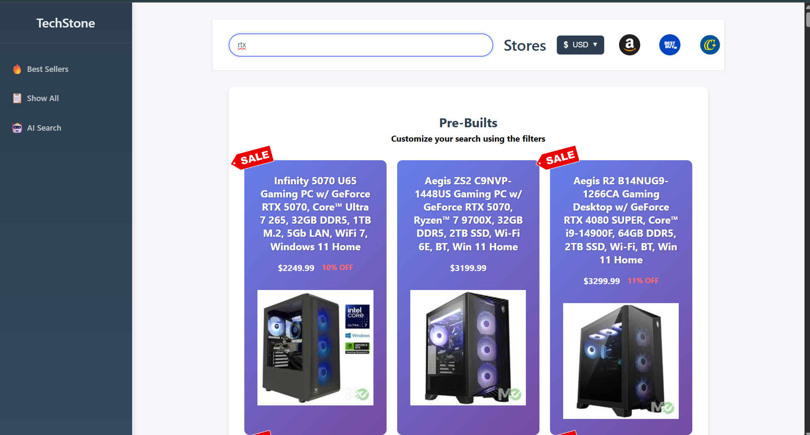

# Techstone

Welcome to TechStone!

When buying a pre-built computer, how many websites did you usually go to? Wouldn't it be nice if all of them were together?
This is the point of TechStone: having a collection of popular websites for pre-built computers all in one spot! 

This project combines Best Buy, Canada Computers, and Memory Express. The website will show approximately 200 listings 

We implemented the following features:

- Website receives new listings daily 
- Filter/search for best sellers
- Able to change to most currencies 
- AI Chatbox for assistance

# TechStack
React.js
Python
Docker
MongoDB
AWS Lambda
AWS Event Bridge
AWS Elastic Container Registry

Here is what it looks like as of right now. 

# Setup 

First things first, I recommend you fork this repo and then clone it locally. You would need Node.js and npm to use React.js locally. 
You would need to supply the API keys for currencies and our AI chatbox, put them in a .js file in frontend/src/config. For example 
exchangeRate.js should contain EXCHANGE_RATE_API_KEY and EXCHANGE_RATE_BASE_URL. 

The next big part will be making 2 lambda functions. But first, you need to make a cluster in MongoDB to store PC listings in.
Make sure you have the connection string for it. Now you will need to make a Docker image for the AWS Lambda function to work (the files are in scripts/awsLambdaScraperImage). Push that image to 
your ECR private repo. Then you can use that for AWS Lambda. Note: Use the legacy builder for the image if AWS says that the image isn't supported. Make sure you have env variable for your MongoDB
Use EventBridge (optional) for scrape to whatever frequency you want. If you got the scraping down, now we want the frontend to actually see those listings! I didn't give the file for that for 
security reasons, but it should be straightforward to fetch. 

That should be it, but if there are any further complications, feel free to contact us. 

